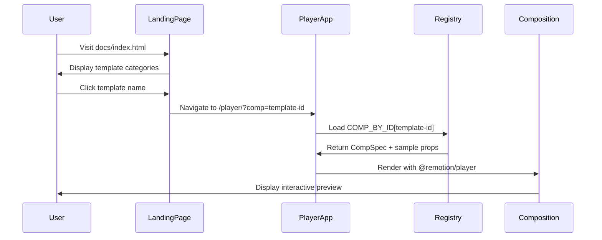

# Design Document: AWS Community Austria Templates Library v2

## Overview

This design document describes the architecture and implementation for the AWS Community Austria Templates Library v2 — a documentation and preview system for the `aws-community-austria-templates` repository. The system consists of two main components:

1. **Landing Page** (`docs/index.html`) — A static HTML page showcasing available templates organized by category
2. **Player App** (`player/`) — A Vite + React application using `@remotion/player` for interactive composition previews

The solution follows the established pattern from `freelancer-templates.org/player`, adapted for the AWS Community Austria branding and deployed via GitHub Pages.

### Key Design Decisions

- **Vite + React**: Chosen for fast builds and excellent developer experience, matching the existing player architecture
- **Path Aliases**: Compositions imported from parent `aws-community-austria-templates/src` via Vite aliases to avoid code duplication
- **Package Deduplication**: React, Remotion, and related packages resolved from `player/node_modules` to prevent duplicate React instances
- **Static Deployment**: Build output designed for GitHub Pages with relative paths (`base: "./"`)
- **Dark Theme**: Consistent with AWS Community branding using dark backgrounds (#0f172a) and orange accents (#f97316)

## Architecture

```mermaid
graph TB
    subgraph "aws-community-austria-templates repo"
        SRC[src/compositions/*]
        PUB[public/assets/*]
        
        subgraph "docs/"
            LP[index.html<br/>Landing Page]
        end
        
        subgraph "player/"
            VITE[vite.config.ts]
            APP[src/App.tsx]
            REG[src/registry.ts]
            SAMPLE[src/sampleData.ts]
            MAIN[src/main.tsx]
        end
        
        subgraph ".github/workflows/"
            DEPLOY[deploy.yml]
        end
    end
    
    subgraph "GitHub Pages Output"
        ROOT[/ index.html]
        PLAYER[/player/ index.html + assets]
    end
    
    SRC --> |path alias| APP
    PUB --> |publicDir| VITE
    REG --> APP
    SAMPLE --> APP
    LP --> |link| PLAYER
    DEPLOY --> |builds| ROOT
    DEPLOY --> |builds| PLAYER
```

### Data Flow



## Components and Interfaces

### Registry Module (`player/src/registry.ts`)

```typescript
// Type for any React functional component
type FC = React.FC<any>;

// Composition specification
export interface CompSpec {
  id: string;                    // Unique identifier (kebab-case)
  component: FC;                 // React component reference
  durationInFrames: number;      // Total frames for playback
  fps: number;                   // Frames per second (typically 30)
  width: number;                 // Composition width in pixels
  height: number;                // Composition height in pixels
  category: string;              // Category for filtering (Slides, Social, Stills, Venue)
}

// Exported constants
export const COMPOSITIONS: CompSpec[];           // All registered compositions
export const COMP_BY_ID: Record<string, CompSpec>; // O(1) lookup by id
export const CATEGORIES: string[];               // Unique category names
```

### Sample Data Module (`player/src/sampleData.ts`)

```typescript
// Sample props for each composition type
export const SAMPLE_TITLE_SLIDE: TitleSlideProps;
export const SAMPLE_WELCOME_SLIDE: WelcomeSlideProps;
export const SAMPLE_AGENDA_SLIDE: AgendaSlideProps;
export const SAMPLE_SPEAKER_SLIDE: SpeakerSlideProps;
export const SAMPLE_TEAM_SLIDE: TeamSlideProps;
export const SAMPLE_SPONSORS_SLIDE: SponsorsSlideProps;
export const SAMPLE_THANK_YOU_SLIDE: ThankYouSlideProps;
export const SAMPLE_MEETUP_SEQUENCE: MeetupSequenceProps;
export const SAMPLE_LINKEDIN_ANNOUNCEMENT: LinkedInAnnouncementProps;
export const SAMPLE_LINKEDIN_RECAP: LinkedInRecapProps;
export const SAMPLE_MEETUP_THUMBNAIL: MeetupThumbnailProps;
export const SAMPLE_BACKGROUND_LOOP: BackgroundLoopVideoProps;

// Lookup by composition id
export const SAMPLE_PROPS: Record<string, object>;
```

### Player App Component (`player/src/App.tsx`)

```typescript
interface AppState {
  active: CompSpec;              // Currently selected composition
  search: string;                // Search filter text
  categoryFilter: string | null; // Selected category filter
}

// URL parameter helpers
function getCompFromUrl(): string;
function isEmbed(): boolean;
function setCompInUrl(id: string): void;

// Main App component
export const App: React.FC;
```

### Vite Configuration (`player/vite.config.ts`)

```typescript
export default defineConfig({
  plugins: [react()],
  base: "./",                    // Relative paths for GitHub Pages subdirectory
  publicDir: "../public",        // Point to aws-community-austria-templates/public
  build: {
    outDir: "../docs/player",    // Build to docs/player for GitHub Pages
    emptyOutDir: true,
  },
  resolve: {
    alias: {
      // Deduplicate packages
      react: "player/node_modules/react",
      "react-dom": "player/node_modules/react-dom",
      remotion: "player/node_modules/remotion",
      "@remotion/transitions": "player/node_modules/@remotion/transitions",
      // Source compositions
      "@compositions": "../src/compositions",
      "@components": "../src/components",
      "@design": "../src/design",
    },
  },
});
```

## Data Models

### Composition Categories

| Category | Compositions | Typical Dimensions | Duration |
|----------|-------------|-------------------|----------|
| Slides | TitleSlide, WelcomeSlide, AgendaSlide, SpeakerSlide, TeamSlide, SponsorsSlide, ThankYouSlide, MeetupSequence | 1920×1080 | 300 frames (10s) |
| Social | LinkedInAnnouncement, LinkedInRecap | 1080×1080 | 600-900 frames (20-30s) |
| Stills | MeetupThumbnail | 1920×1080 | 1 frame |
| Venue | BackgroundLoopVideo | 1920×1080 | 900 frames (30s loop) |

### Sample Data Structure

```typescript
// Example: TitleSlide sample data
const SAMPLE_TITLE_SLIDE: TitleSlideProps = {
  groupName: "AWS User Group Vienna",
  groupShortName: "AWS UG Vienna",
  meetupNumber: 48,
  title: "Cloud Native & Serverless",
  date: "2025-01-15",
  venue: "TechHub Vienna",
  hostedBy: "Example Corp",
  logoPath: "assets/aws-ug-vienna-logo.png",
};

// Example: AgendaSlide sample data
const SAMPLE_AGENDA_SLIDE: AgendaSlideProps = {
  groupName: "AWS User Group Vienna",
  agenda: [
    { time: "18:00", label: "Doors Open & Networking" },
    { time: "18:30", label: "Welcome & Announcements" },
    { time: "18:45", label: "Talk 1: Building with CDK" },
    { time: "19:30", label: "Break" },
    { time: "19:45", label: "Talk 2: Serverless Patterns" },
    { time: "20:30", label: "Networking & Drinks" },
  ],
};
```

## Error Handling

### Player App Error States

| Error Condition | Handling Strategy |
|----------------|-------------------|
| Invalid `comp` URL parameter | Fall back to first composition in registry |
| Missing sample data for composition | Display placeholder message in player area |
| Composition render error | Catch with React error boundary, show error message |
| Asset loading failure (staticFile) | Remotion handles gracefully with placeholder |

### Build-Time Validation

- TypeScript compilation catches type mismatches between sample data and composition props
- Vite build fails if path aliases cannot be resolved
- Missing dependencies detected during `npm ci`

## Testing Strategy

### Unit Tests

Unit tests verify specific behaviors with concrete examples:

1. **Registry Tests**
   - Verify all 12 compositions are registered
   - Verify COMP_BY_ID contains all composition ids
   - Verify CATEGORIES contains expected categories

2. **Sample Data Tests**
   - Verify sample props match composition prop types
   - Verify all required fields are present

3. **URL Helper Tests**
   - Test `getCompFromUrl()` with various URL formats
   - Test `isEmbed()` detection
   - Test `setCompInUrl()` updates URL correctly

### Integration Tests

1. **Player Rendering**
   - Verify player loads with default composition
   - Verify composition switching updates player
   - Verify embed mode hides sidebar

2. **Build Output**
   - Verify `docs/player/index.html` exists after build
   - Verify assets are correctly bundled
   - Verify relative paths work in subdirectory

### Manual Testing Checklist

- [ ] Landing page displays all categories
- [ ] Template links navigate to player with correct composition
- [ ] Search filters compositions correctly
- [ ] Category filters work
- [ ] Keyboard navigation (arrow keys) works
- [ ] Embed mode (`?embed=1`) shows player only
- [ ] Responsive layout works on mobile
- [ ] Dark theme colors are consistent


## Correctness Properties

*A property is a characteristic or behavior that should hold true across all valid executions of a system — essentially, a formal statement about what the system should do. Properties serve as the bridge between human-readable specifications and machine-verifiable correctness guarantees.*

After analyzing the acceptance criteria, this feature has limited applicability for property-based testing because:

1. **Landing Page** — Static HTML content, best tested with example-based tests and snapshot tests
2. **Player UI** — React component rendering, best tested with component tests and visual regression
3. **Build/Deploy** — Infrastructure configuration, best tested with integration tests

However, the following filtering and URL handling behaviors can benefit from property-based testing:

### Property 1: Search Filter Correctness

*For any* search string and composition list, all compositions returned by the search filter SHALL have ids that contain the search string (case-insensitive).

**Validates: Requirements 6.3**

### Property 2: Category Filter Correctness

*For any* selected category and composition list, all compositions returned by the category filter SHALL have a category field matching the selected category.

**Validates: Requirements 6.4**

### Property 3: URL Composition Selection Round-Trip

*For any* valid composition id, setting the URL parameter `?comp={id}` and then reading it back SHALL return the same composition id.

**Validates: Requirements 6.6, 6.7**

### Property 4: Registry Lookup Consistency

*For any* composition in the COMPOSITIONS array, looking it up by id in COMP_BY_ID SHALL return the same composition object.

**Validates: Requirements 4.3, 4.4**

---

**Note on Testing Approach**: Given the nature of this feature (UI rendering, static content, infrastructure), the testing strategy emphasizes:
- **Example-based unit tests** for specific behaviors
- **Integration tests** for build output verification
- **Smoke tests** for configuration validation
- **Property-based tests** only for the filtering and lookup logic where input variation matters
