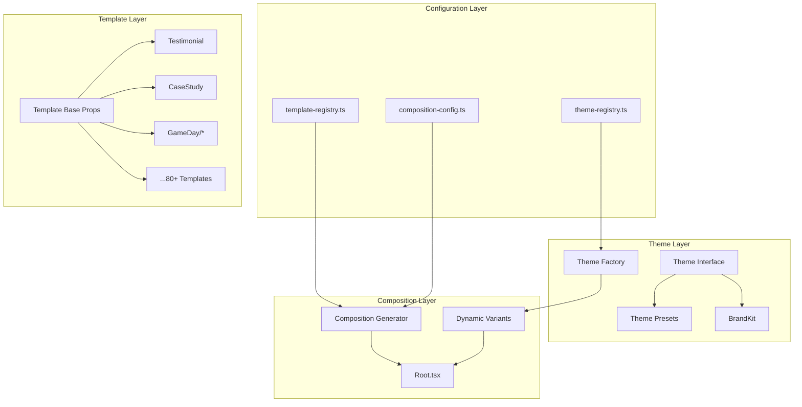
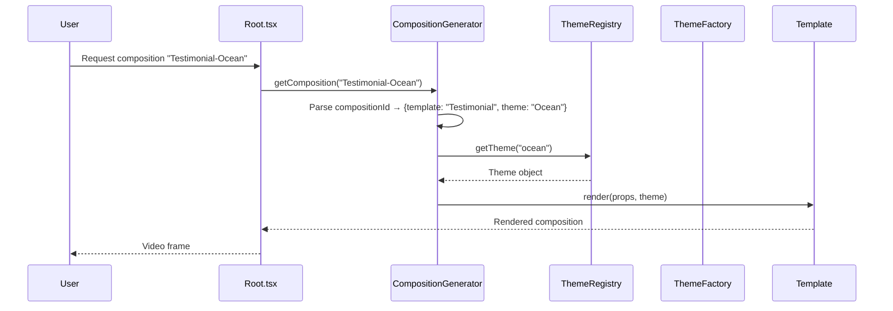
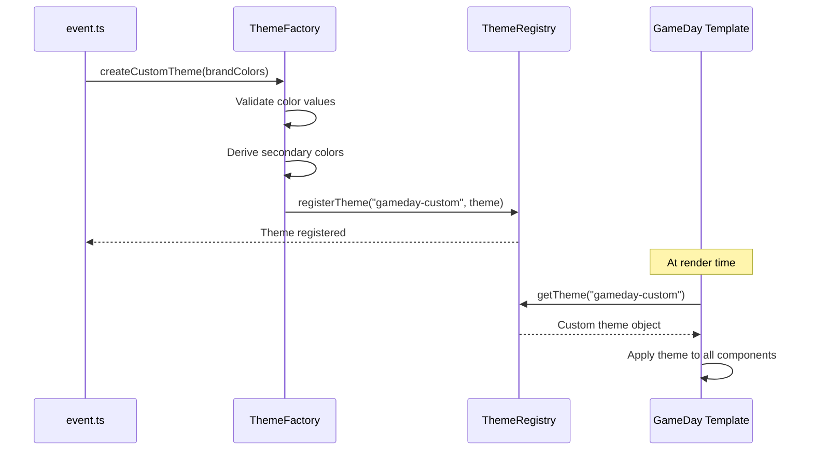
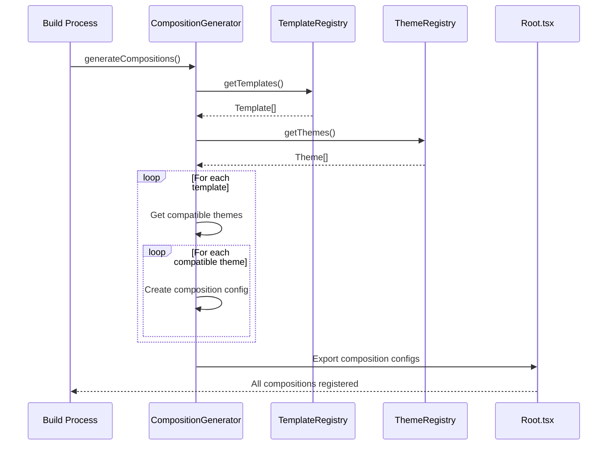

# Design Document: Configuration-Based Theme Framework

## Overview

This design document describes a configuration-based theme framework that decouples themes from templates in the Remotion video generation system. The current architecture suffers from tight coupling between templates and themes, resulting in a combinatorial explosion of 80+ templates × 42 themes = 3,360+ potential compositions, each requiring manual implementation. This framework introduces a registry-based approach where templates are theme-agnostic components that receive theme objects as props, and compositions are dynamically generated from configuration at build time.

The framework solves three critical problems: (1) the orphaned template problem where templates exist in data files but lack Remotion implementations, (2) the inability for GameDay templates to support custom color branding, and (3) the maintenance burden of updating every template when adding new themes. By centralizing theme definitions and using dynamic composition generation, adding a new theme becomes a single-file change that automatically applies to all compatible templates.

## Architecture

The architecture follows a layered approach with clear separation between theme definitions, template implementations, and composition generation.



## Sequence Diagrams

### Theme Resolution Flow



### Custom Brand Theme Flow (GameDay)



### Dynamic Composition Generation



## Components and Interfaces

### Component 1: ThemeRegistry

**Purpose**: Central registry for all theme definitions, providing lookup, validation, and iteration capabilities.

**Interface**:
```typescript
interface ThemeRegistry {
  // Core operations
  getTheme(name: string): Theme | undefined;
  getAllThemes(): Theme[];
  getThemeNames(): string[];
  
  // Registration
  registerTheme(name: string, theme: Theme): void;
  registerPreset(preset: ThemePreset): void;
  
  // Filtering
  getThemesByCategory(category: ThemeCategory): Theme[];
  getCompatibleThemes(templateId: string): Theme[];
  
  // Validation
  isValidTheme(theme: unknown): theme is Theme;
}
```

**Responsibilities**:
- Store and retrieve theme definitions by name
- Validate theme objects against the Theme interface
- Support categorization (original, extended, european, flat, canva)
- Provide filtering for template compatibility

### Component 2: TemplateRegistry

**Purpose**: Central registry for template metadata, including layout variants, default props, and theme compatibility.

**Interface**:
```typescript
interface TemplateRegistry {
  // Core operations
  getTemplate(id: string): TemplateConfig | undefined;
  getAllTemplates(): TemplateConfig[];
  
  // Registration
  registerTemplate(config: TemplateConfig): void;
  
  // Queries
  getTemplatesByCategory(category: string): TemplateConfig[];
  getOrphanedTemplates(): TemplateConfig[];
  
  // Validation
  validateTemplate(config: TemplateConfig): ValidationResult;
}
```

**Responsibilities**:
- Store template configurations with metadata
- Track which templates have Remotion implementations
- Identify orphaned templates (in data but no implementation)
- Provide template filtering and categorization

### Component 3: CompositionGenerator

**Purpose**: Dynamically generates Remotion composition configurations from template and theme registries.

**Interface**:
```typescript
interface CompositionGenerator {
  // Generation
  generateCompositions(): CompositionConfig[];
  generateForTemplate(templateId: string): CompositionConfig[];
  generateForTheme(themeName: string): CompositionConfig[];
  
  // Configuration
  setDefaultDuration(frames: number): void;
  setDefaultFps(fps: number): void;
  setDefaultDimensions(width: number, height: number): void;
  
  // Export
  exportToRoot(): string; // Generate Root.tsx content
  exportToJson(): string; // Generate composition manifest
}
```

**Responsibilities**:
- Combine templates × themes into composition configs
- Apply default props and sample data
- Generate unique composition IDs
- Maintain backward compatibility with existing URLs

### Component 4: ThemeFactory

**Purpose**: Creates and customizes themes, including deriving secondary colors and applying brand kits.

**Interface**:
```typescript
interface ThemeFactory {
  // Creation
  createTheme(config: ThemeConfig): Theme;
  createFromBrandKit(baseTheme: Theme, brandKit: BrandKit): Theme;
  
  // Derivation
  deriveSecondaryColors(primaryColor: string): DerivedColors;
  deriveTextColors(backgroundColor: string): TextColors;
  
  // Validation
  validateColors(colors: Partial<Theme>): ValidationResult;
  
  // Presets
  getPreset(name: string): Theme;
  listPresets(): string[];
}
```

**Responsibilities**:
- Create new themes from configuration
- Apply BrandKit overrides to base themes
- Derive complementary colors automatically
- Validate color contrast for accessibility

## Data Models

### Model 1: Theme

```typescript
interface Theme {
  // Identity
  name: string;
  category: ThemeCategory;
  
  // Backgrounds
  bg: string;                    // Main background (color or gradient)
  bgSecondary: string;           // Card/panel background
  bgGlass: string;               // Glassmorphism background (with alpha)
  
  // Text
  textPrimary: string;
  textSecondary: string;
  textMuted: string;
  
  // Accents
  accent: string;                // Primary accent (buttons, highlights)
  accentSecondary: string;       // Secondary accent (gradients, borders)
  accentGradient: string;        // CSS gradient string
  
  // Cards
  cardBorder: string;
  cardShadow: string;
  borderRadius: number;
  
  // Typography
  fontFamily: string;
  headingWeight: number;
  bodyWeight: number;
}

type ThemeCategory = 
  | "original" 
  | "extended" 
  | "european" 
  | "flat" 
  | "canva" 
  | "custom";
```

**Validation Rules**:
- All color values must be valid CSS colors (hex, rgb, rgba, hsl)
- `bg` can be a color or CSS gradient string
- `borderRadius` must be non-negative
- `headingWeight` and `bodyWeight` must be valid font weights (100-900)
- `fontFamily` must be a valid CSS font-family string

### Model 2: TemplateConfig

```typescript
interface TemplateConfig {
  // Identity
  id: string;                    // e.g., "testimonial"
  name: string;                  // e.g., "Testimonial"
  description: string;
  
  // Component reference
  component: React.ComponentType<TemplateProps>;
  
  // Variants
  layouts: string[];             // e.g., ["centered", "split", "editorial"]
  defaultLayout: string;
  
  // Dimensions
  width: number;
  height: number;
  fps: number;
  durationInFrames: number;
  
  // Theme compatibility
  compatibleThemes?: string[];   // If undefined, all themes compatible
  excludedThemes?: string[];     // Themes to exclude
  
  // Sample data
  defaultProps: Record<string, unknown>;
  sampleSpecs: Record<string, unknown>[];
  
  // Metadata
  icon: string;
  color: string;
  category: string;
  hasImplementation: boolean;    // false = orphaned template
}
```

**Validation Rules**:
- `id` must be lowercase kebab-case
- `layouts` must have at least one entry
- `defaultLayout` must be in `layouts` array
- `width` and `height` must be positive integers
- `fps` must be 24, 25, 30, or 60
- `durationInFrames` must be positive

### Model 3: CompositionConfig

```typescript
interface CompositionConfig {
  // Identity
  id: string;                    // e.g., "Testimonial-Ocean-Centered"
  legacyId?: string;             // For backward compatibility
  
  // Component
  component: React.ComponentType<any>;
  
  // Dimensions
  width: number;
  height: number;
  fps: number;
  durationInFrames: number;
  
  // Props
  defaultProps: {
    theme: Theme;
    layout: string;
    spec: Record<string, unknown>;
    brandKit?: BrandKit;
  };
  
  // Schema (for Remotion Studio)
  schema?: z.ZodType<any>;
  
  // Metadata
  templateId: string;
  themeName: string;
  layoutName: string;
}
```

### Model 4: BrandKit

```typescript
interface BrandKit {
  // Logo
  logoUrl?: string;
  
  // Colors
  primaryColor?: string;         // → theme.accent + gradient start
  secondaryColor?: string;       // → theme.accentSecondary + gradient end
  accentColor?: string;          // → fallback accentSecondary
  bgColor?: string;              // → bg + derived bgSecondary/bgGlass
  textColor?: string;            // → textPrimary + derived secondary/muted
  
  // Typography
  fontFamily?: string;
  
  // Status colors (for GameDay)
  successColor?: string;         // → GD_GREEN equivalent
  errorColor?: string;           // → GD_RED equivalent
}
```

**Validation Rules**:
- All color fields must be valid hex colors (#RRGGBB or #RGB)
- `logoUrl` must be a valid URL or relative path
- `fontFamily` must be a valid CSS font-family string

## Algorithmic Pseudocode

### Main Composition Generation Algorithm

```typescript
/**
 * Generates all composition configurations from template and theme registries.
 * 
 * @precondition templateRegistry is initialized with all templates
 * @precondition themeRegistry is initialized with all themes
 * @postcondition Returns array of valid CompositionConfig objects
 * @postcondition All returned compositions have unique IDs
 * @postcondition Legacy IDs are preserved for backward compatibility
 */
function generateCompositions(
  templateRegistry: TemplateRegistry,
  themeRegistry: ThemeRegistry
): CompositionConfig[] {
  const compositions: CompositionConfig[] = [];
  const usedIds = new Set<string>();
  
  // Iterate all templates
  for (const template of templateRegistry.getAllTemplates()) {
    // Skip orphaned templates (no implementation)
    if (!template.hasImplementation) {
      continue;
    }
    
    // Get compatible themes for this template
    const themes = getCompatibleThemes(template, themeRegistry);
    
    // Generate compositions for each theme × layout combination
    for (const theme of themes) {
      for (const layout of template.layouts) {
        const config = createCompositionConfig(template, theme, layout);
        
        // Ensure unique ID
        if (usedIds.has(config.id)) {
          config.id = generateUniqueId(config.id, usedIds);
        }
        usedIds.add(config.id);
        
        compositions.push(config);
      }
    }
  }
  
  return compositions;
}

/**
 * @invariant All processed templates have hasImplementation === true
 * @invariant No duplicate IDs in returned array
 */
```

### Theme Compatibility Resolution

```typescript
/**
 * Determines which themes are compatible with a given template.
 * 
 * @precondition template is a valid TemplateConfig
 * @precondition themeRegistry contains all available themes
 * @postcondition Returns themes that pass all compatibility checks
 */
function getCompatibleThemes(
  template: TemplateConfig,
  themeRegistry: ThemeRegistry
): Theme[] {
  const allThemes = themeRegistry.getAllThemes();
  
  // If template specifies compatible themes, use only those
  if (template.compatibleThemes && template.compatibleThemes.length > 0) {
    return allThemes.filter(theme => 
      template.compatibleThemes!.includes(theme.name)
    );
  }
  
  // Otherwise, use all themes except excluded ones
  const excluded = new Set(template.excludedThemes ?? []);
  return allThemes.filter(theme => !excluded.has(theme.name));
}
```

### BrandKit Application Algorithm

```typescript
/**
 * Applies BrandKit overrides to a base theme, deriving secondary colors.
 * 
 * @precondition baseTheme is a valid Theme object
 * @precondition brandKit contains valid color values (if provided)
 * @postcondition Returns new Theme with brandKit colors applied
 * @postcondition Original baseTheme is not mutated
 */
function applyBrandKit(baseTheme: Theme, brandKit?: BrandKit): Theme {
  if (!brandKit) {
    return baseTheme;
  }
  
  const result = { ...baseTheme };
  
  // Apply primary color → accent + gradient
  if (brandKit.primaryColor) {
    const secondary = brandKit.secondaryColor 
      ?? brandKit.accentColor 
      ?? baseTheme.accentSecondary;
    
    result.accent = brandKit.primaryColor;
    result.accentSecondary = secondary;
    result.accentGradient = `linear-gradient(135deg, ${brandKit.primaryColor}, ${secondary})`;
    result.cardBorder = `${brandKit.primaryColor}40`; // 25% opacity
  }
  
  // Apply background color → bg + derived colors
  if (brandKit.bgColor) {
    const [r, g, b] = hexToRgb(brandKit.bgColor);
    const isLight = calculateLuminance(r, g, b) > 0.18;
    const shift = isLight ? -14 : 22;
    
    result.bg = brandKit.bgColor;
    result.bgSecondary = shiftColor(brandKit.bgColor, shift);
    result.bgGlass = `rgba(${r}, ${g}, ${b}, 0.55)`;
    result.cardShadow = isLight 
      ? "0 4px 24px rgba(0,0,0,0.10)" 
      : "0 4px 24px rgba(0,0,0,0.45)";
  }
  
  // Apply text color → textPrimary + derived
  if (brandKit.textColor) {
    result.textPrimary = brandKit.textColor;
    result.textSecondary = `${brandKit.textColor}b3`; // 70% opacity
    result.textMuted = `${brandKit.textColor}73`;     // 45% opacity
  }
  
  // Apply font family
  if (brandKit.fontFamily) {
    result.fontFamily = brandKit.fontFamily;
  }
  
  return result;
}

/**
 * @invariant result.accent is set if brandKit.primaryColor is provided
 * @invariant result.bg is set if brandKit.bgColor is provided
 * @invariant Derived colors maintain visual coherence with primary colors
 */
```

### Composition ID Generation

```typescript
/**
 * Generates a composition ID from template, theme, and layout.
 * Maintains backward compatibility with existing URL patterns.
 * 
 * @precondition template.id is valid kebab-case
 * @precondition theme.name is valid lowercase identifier
 * @precondition layout is a valid layout name
 * @postcondition Returns PascalCase ID matching legacy pattern
 */
function generateCompositionId(
  template: TemplateConfig,
  theme: Theme,
  layout: string
): string {
  const templatePascal = toPascalCase(template.id);
  const themePascal = toPascalCase(theme.name);
  const layoutPascal = toPascalCase(layout);
  
  // Match legacy pattern: "Testimonial-Dark-Centered"
  return `${templatePascal}-${themePascal}-${layoutPascal}`;
}

/**
 * Generates a unique ID by appending a numeric suffix.
 * 
 * @precondition baseId is a valid composition ID
 * @precondition usedIds contains all previously used IDs
 * @postcondition Returns ID not in usedIds
 */
function generateUniqueId(baseId: string, usedIds: Set<string>): string {
  let suffix = 2;
  let candidateId = `${baseId}-${suffix}`;
  
  while (usedIds.has(candidateId)) {
    suffix++;
    candidateId = `${baseId}-${suffix}`;
  }
  
  return candidateId;
}
```

## Key Functions with Formal Specifications

### Function 1: ThemeRegistry.getTheme()

```typescript
function getTheme(name: string): Theme | undefined
```

**Preconditions:**
- `name` is a non-empty string
- `name` is lowercase (case-insensitive lookup performed internally)

**Postconditions:**
- Returns Theme object if theme with matching name exists
- Returns undefined if no matching theme found
- Returned Theme is a frozen object (immutable)

**Loop Invariants:** N/A (direct map lookup)

### Function 2: CompositionGenerator.generateForTemplate()

```typescript
function generateForTemplate(templateId: string): CompositionConfig[]
```

**Preconditions:**
- `templateId` is a valid template identifier
- Template with `templateId` exists in registry
- Template has `hasImplementation === true`

**Postconditions:**
- Returns array of CompositionConfig objects
- Array length equals `compatibleThemes.length × layouts.length`
- All returned configs have unique IDs
- All returned configs reference the same template

**Loop Invariants:**
- For theme iteration: All previously processed themes have generated valid configs
- For layout iteration: All previously processed layouts have generated valid configs

### Function 3: ThemeFactory.deriveSecondaryColors()

```typescript
function deriveSecondaryColors(primaryColor: string): DerivedColors
```

**Preconditions:**
- `primaryColor` is a valid hex color (#RRGGBB or #RGB)

**Postconditions:**
- Returns DerivedColors object with all fields populated
- `secondary` is a complementary color to `primary`
- `muted` has reduced saturation compared to `primary`
- All returned colors are valid hex colors

**Loop Invariants:** N/A (pure calculation)

### Function 4: TemplateRegistry.getOrphanedTemplates()

```typescript
function getOrphanedTemplates(): TemplateConfig[]
```

**Preconditions:**
- Registry is initialized with template data from `data/templates.json`

**Postconditions:**
- Returns array of templates where `hasImplementation === false`
- Returned templates exist in data files but lack Remotion components
- Array is sorted by template ID

**Loop Invariants:**
- All previously checked templates have been correctly classified

## Example Usage

```typescript
// Example 1: Initialize registries and generate compositions
import { ThemeRegistry, TemplateRegistry, CompositionGenerator } from "./themes";

const themeRegistry = new ThemeRegistry();
themeRegistry.registerPresets(BUILT_IN_THEMES);

const templateRegistry = new TemplateRegistry();
templateRegistry.loadFromJson("data/templates.json");

const generator = new CompositionGenerator(templateRegistry, themeRegistry);
const compositions = generator.generateCompositions();

// Example 2: Create custom GameDay theme
import { ThemeFactory, THEME_DARK } from "./themes";

const gameDayBrandKit: BrandKit = {
  primaryColor: "#6c3fa0",    // GD_PURPLE
  secondaryColor: "#d946ef",  // GD_PINK
  accentColor: "#ff9900",     // GD_ORANGE
  bgColor: "#0c0820",         // GD_DARK
};

const gameDayTheme = ThemeFactory.createFromBrandKit(THEME_DARK, gameDayBrandKit);
themeRegistry.registerTheme("gameday", gameDayTheme);

// Example 3: Render template with theme
import { Testimonial } from "./templates/testimonial";

const MyComposition: React.FC = () => {
  const theme = themeRegistry.getTheme("ocean");
  return (
    <Testimonial
      spec={testimonialData}
      theme={theme}
      layout="centered"
    />
  );
};

// Example 4: Dynamic Root.tsx generation
const rootContent = generator.exportToRoot();
// Outputs JSX with all <Composition> elements
```

## Correctness Properties

The following properties must hold for the system to be correct:

1. **Theme Immutability**: ∀ theme ∈ ThemeRegistry: theme is frozen and cannot be mutated after registration

2. **Composition Uniqueness**: ∀ c1, c2 ∈ Compositions: c1.id ≠ c2.id (no duplicate IDs)

3. **Backward Compatibility**: ∀ legacyUrl ∈ ExistingUrls: ∃ composition ∈ Compositions where composition.legacyId matches legacyUrl pattern

4. **Theme Completeness**: ∀ template ∈ Templates where template.hasImplementation: |getCompatibleThemes(template)| ≥ 1

5. **Color Validity**: ∀ theme ∈ Themes: isValidCssColor(theme.bg) ∧ isValidCssColor(theme.accent) ∧ ...

6. **BrandKit Idempotence**: applyBrandKit(applyBrandKit(theme, kit), kit) === applyBrandKit(theme, kit)

## Error Handling

### Error Scenario 1: Invalid Theme Registration

**Condition**: Attempting to register a theme with invalid color values or missing required fields
**Response**: Throw `ThemeValidationError` with detailed field-level errors
**Recovery**: Caller must fix validation errors before retrying registration

### Error Scenario 2: Orphaned Template Reference

**Condition**: Composition references a template that exists in data but has no implementation
**Response**: Log warning and skip composition generation for that template
**Recovery**: Template implementation must be created, or template removed from data

### Error Scenario 3: Duplicate Composition ID

**Condition**: Generated composition ID conflicts with existing ID
**Response**: Automatically append numeric suffix to create unique ID
**Recovery**: Automatic - no manual intervention required

### Error Scenario 4: Invalid BrandKit Colors

**Condition**: BrandKit contains invalid hex color values
**Response**: Throw `BrandKitValidationError` with specific invalid fields
**Recovery**: Caller must provide valid hex colors

## Testing Strategy

### Unit Testing Approach

- Test ThemeRegistry CRUD operations with valid and invalid inputs
- Test TemplateRegistry loading from JSON with various data shapes
- Test CompositionGenerator output for known template/theme combinations
- Test ThemeFactory color derivation algorithms
- Test BrandKit application with edge cases (partial overrides, null values)

**Key Test Cases**:
- Theme registration with all valid fields
- Theme registration with missing required fields
- Composition generation with 0, 1, and many templates
- BrandKit application with only primaryColor set
- BrandKit application with all fields set
- Legacy ID generation matches existing patterns

### Property-Based Testing Approach

**Property Test Library**: fast-check

**Properties to Test**:
1. `∀ theme: applyBrandKit(theme, undefined) === theme`
2. `∀ template, themes: generateForTemplate(template).length === themes.length × layouts.length`
3. `∀ compositions: new Set(compositions.map(c => c.id)).size === compositions.length`
4. `∀ hexColor: isValidHex(hexColor) ⟹ isValidHex(deriveSecondaryColors(hexColor).secondary)`

### Integration Testing Approach

- Test full composition generation pipeline from JSON data to Root.tsx output
- Test Remotion Studio loads all generated compositions without errors
- Test existing preview URLs continue to work after migration
- Test GameDay templates render correctly with custom BrandKit

## Performance Considerations

- **Lazy Theme Loading**: Themes are loaded on-demand rather than all at once
- **Composition Caching**: Generated compositions are cached and only regenerated when registries change
- **Immutable Themes**: Frozen theme objects enable safe sharing without defensive copying
- **Build-Time Generation**: Composition configs are generated at build time, not runtime

## Security Considerations

- **Color Validation**: All color inputs are validated to prevent CSS injection
- **URL Validation**: Logo URLs in BrandKit are validated against allowlist
- **No Dynamic Code**: Composition generation uses static configuration, no eval() or dynamic imports

## Dependencies

- **Remotion**: ^4.0.0 - Video rendering framework
- **Zod**: ^3.22.0 - Runtime type validation for composition schemas
- **React**: ^18.2.0 - Component framework
- **TypeScript**: ^5.0.0 - Type safety and interfaces
