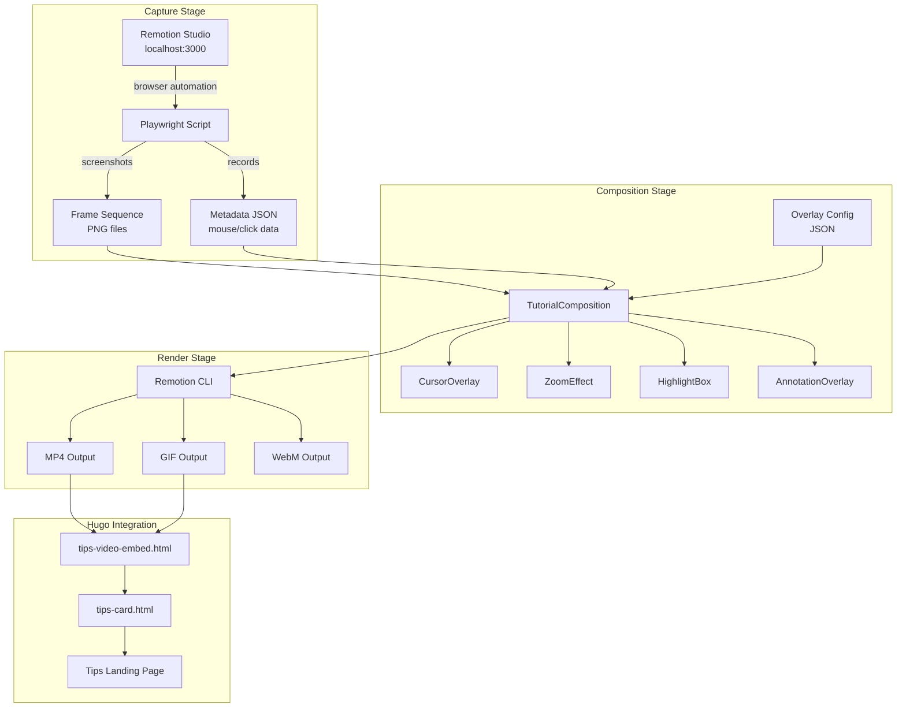
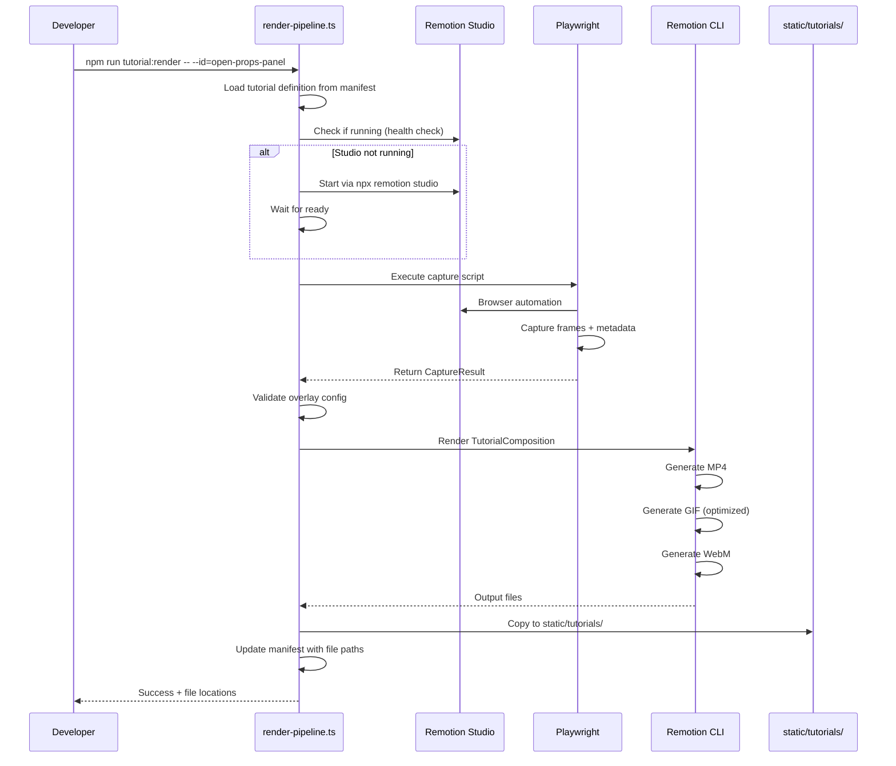

# Design Document: Video Tutorial Screencasts

## Overview

This design specifies the technical implementation for creating animated video tutorials that demonstrate Remotion Studio interactions. The system captures screen recordings using Playwright browser automation, then renders them with overlay components (cursor, zoom, highlights, annotations) using Remotion compositions.

The architecture follows a three-stage pipeline:
1. **Capture Stage**: Playwright scripts record interactions from Remotion Studio, outputting frame sequences and metadata
2. **Composition Stage**: Remotion components layer overlays onto captured frames based on JSON configuration
3. **Render Stage**: Automated pipeline produces optimized MP4/GIF/WebM files for embedding in tips pages

This design integrates with the existing project structure, placing tutorial-specific Remotion components in `src/remotion/tutorials/`, capture scripts in `scripts/tutorials/`, and rendered assets in `static/tutorials/`.

## Architecture



## Components and Interfaces

### Directory Structure

```
project-root/
├── src/remotion/tutorials/           # Remotion tutorial components
│   ├── index.ts                      # Exports all tutorial compositions
│   ├── TutorialComposition.tsx       # Main composition combining all layers
│   ├── overlays/                     # Overlay components
│   │   ├── CursorOverlay.tsx         # Animated cursor with click indicators
│   │   ├── ZoomEffect.tsx            # Smooth zoom in/out animations
│   │   ├── HighlightBox.tsx          # Pulsing highlight rectangles
│   │   └── AnnotationOverlay.tsx     # Text labels and arrows
│   ├── utils/                        # Shared utilities
│   │   ├── easing.ts                 # Easing functions for animations
│   │   └── frameLoader.ts            # Frame sequence loading utilities
│   └── types.ts                      # TypeScript interfaces
│
├── scripts/tutorials/                # Capture and render scripts
│   ├── capture/                      # Playwright capture scripts
│   │   ├── base-capture.ts           # Base capture class with common methods
│   │   ├── studio-basics/            # Capture scripts by tutorial category
│   │   │   ├── open-props-panel.ts
│   │   │   ├── timeline-scrubber.ts
│   │   │   ├── preview-controls.ts
│   │   │   ├── switch-compositions.ts
│   │   │   └── keyboard-shortcuts.ts
│   │   ├── editing-props/
│   │   │   ├── locate-props-panel.ts
│   │   │   ├── edit-text-prop.ts
│   │   │   ├── color-picker.ts
│   │   │   ├── numeric-values.ts
│   │   │   └── save-preview.ts
│   │   └── cli-rendering/
│   │       ├── open-terminal.ts
│   │       ├── basic-render.ts
│   │       ├── format-options.ts
│   │       └── render-progress.ts
│   ├── render-pipeline.ts            # Main render orchestration script
│   ├── batch-render.ts               # Batch rendering multiple tutorials
│   └── scaffold-tutorial.ts          # CLI to create new tutorial scaffolds
│
├── data/tutorials/                   # Configuration files
│   ├── manifest.json                 # Master list of all tutorials
│   ├── overlay-configs/              # Per-tutorial overlay configurations
│   │   ├── studio-basics/
│   │   │   ├── open-props-panel.json
│   │   │   └── ...
│   │   ├── editing-props/
│   │   └── cli-rendering/
│   └── templates/                    # Overlay config templates
│       ├── basic-click.json
│       ├── zoom-and-click.json
│       └── multi-step.json
│
├── static/tutorials/                 # Rendered output for Hugo
│   ├── studio-basics/
│   │   ├── open-props-panel.mp4
│   │   ├── open-props-panel.gif
│   │   └── ...
│   ├── editing-props/
│   └── cli-rendering/
│
└── layouts/partials/
    └── tips-video-embed.html         # Hugo partial for embedding tutorials
```

### Remotion Component Architecture

#### TutorialComposition

The main composition that orchestrates all overlay layers:

```typescript
// src/remotion/tutorials/TutorialComposition.tsx

interface TutorialCompositionProps {
  frameSequencePath: string;      // Path to captured frame directory
  metadataPath: string;           // Path to capture metadata JSON
  overlayConfig: OverlayConfig;   // Overlay timing and positioning
  fps?: number;                   // Frame rate (default: 30)
  width?: number;                 // Output width (default: 1280)
  height?: number;                // Output height (default: 720)
}

// Layer order (bottom to top):
// 1. FrameSequence - Background captured frames
// 2. ZoomEffect - Applied to frame layer
// 3. HighlightBox - Attention rectangles
// 4. CursorOverlay - Mouse cursor and clicks
// 5. AnnotationOverlay - Text and arrows
```

#### CursorOverlay Component

```typescript
// src/remotion/tutorials/overlays/CursorOverlay.tsx

interface CursorOverlayProps {
  metadata: CaptureMetadata;      // Mouse positions and click events
  cursorStyle?: 'pointer' | 'hand' | 'text';
  clickIndicatorDuration?: number; // ms (default: 400)
  smoothing?: number;             // Easing factor (default: 0.3)
}

interface CaptureMetadata {
  frames: FrameData[];
  clicks: ClickEvent[];
  duration: number;
  fps: number;
}

interface FrameData {
  frameNumber: number;
  timestamp: number;
  mouseX: number;
  mouseY: number;
}

interface ClickEvent {
  frameNumber: number;
  timestamp: number;
  x: number;
  y: number;
  button: 'left' | 'right';
}
```

#### ZoomEffect Component

```typescript
// src/remotion/tutorials/overlays/ZoomEffect.tsx

interface ZoomEffectProps {
  children: React.ReactNode;       // Content to zoom
  zoomConfig: ZoomConfig;
  currentFrame: number;
}

interface ZoomConfig {
  startFrame: number;
  endFrame: number;
  zoomLevel: number;              // 1.5 to 4.0
  targetRegion: {
    x: number;
    y: number;
    width?: number;
    height?: number;
  };
  zoomInDuration?: number;        // frames (default: 15 @ 30fps = 500ms)
  holdDuration?: number;          // frames
  zoomOutDuration?: number;       // frames (default: 15)
  easing?: 'easeInOut' | 'easeOut' | 'spring';
}
```

#### HighlightBox Component

```typescript
// src/remotion/tutorials/overlays/HighlightBox.tsx

interface HighlightBoxProps {
  highlights: HighlightConfig[];
  currentFrame: number;
}

interface HighlightConfig {
  startFrame: number;
  endFrame: number;
  region: {
    x: number;
    y: number;
    width: number;
    height: number;
  };
  style?: {
    borderColor?: string;         // default: brand accent
    borderWidth?: number;         // default: 3
    borderRadius?: number;        // default: 8
    glowColor?: string;
    glowIntensity?: number;
    pulseAnimation?: boolean;     // default: true
  };
  fadeIn?: number;                // frames
  fadeOut?: number;               // frames
}
```

#### AnnotationOverlay Component

```typescript
// src/remotion/tutorials/overlays/AnnotationOverlay.tsx

interface AnnotationOverlayProps {
  annotations: AnnotationConfig[];
  currentFrame: number;
}

interface AnnotationConfig {
  startFrame: number;
  endFrame: number;
  type: 'label' | 'arrow' | 'step-number';
  text?: string;
  position: { x: number; y: number };
  style?: {
    fontSize?: number;            // default: 24
    fontWeight?: 'normal' | 'bold';
    textColor?: string;
    backgroundColor?: string;     // pill background
    padding?: number;
  };
  arrow?: {
    targetX: number;
    targetY: number;
    curved?: boolean;
    color?: string;
    thickness?: number;
  };
  stepNumber?: number;            // For numbered steps
  fadeIn?: number;                // frames
}
```

### Capture Script Structure

#### Base Capture Class

```typescript
// scripts/tutorials/capture/base-capture.ts

interface CaptureConfig {
  studioUrl?: string;             // default: 'http://localhost:3000'
  viewport?: { width: number; height: number };  // default: 1280x720
  captureInterval?: number;       // ms between frames (default: 100)
  outputDir: string;              // Where to save frames
}

interface InteractionStep {
  type: 'navigate' | 'click' | 'type' | 'wait' | 'waitForSelector' | 'hover';
  selector?: string;
  coordinates?: { x: number; y: number };
  text?: string;
  duration?: number;              // ms for wait
  url?: string;                   // for navigate
}

class BaseCapture {
  constructor(config: CaptureConfig);
  
  // Core methods
  async start(): Promise<void>;
  async executeSequence(steps: InteractionStep[]): Promise<void>;
  async captureFrame(): Promise<void>;
  async finish(): Promise<CaptureResult>;
  
  // Interaction helpers
  async navigate(url: string): Promise<void>;
  async click(selector: string): Promise<void>;
  async clickAt(x: number, y: number): Promise<void>;
  async type(selector: string, text: string): Promise<void>;
  async wait(ms: number): Promise<void>;
  async waitForSelector(selector: string): Promise<void>;
  async hover(selector: string): Promise<void>;
  
  // Mouse tracking
  private recordMousePosition(): void;
  private recordClick(x: number, y: number, button: string): void;
}

interface CaptureResult {
  framesDir: string;
  metadataPath: string;
  frameCount: number;
  duration: number;
}
```

#### Example Capture Script

```typescript
// scripts/tutorials/capture/studio-basics/open-props-panel.ts

import { BaseCapture, InteractionStep } from '../base-capture';

const steps: InteractionStep[] = [
  { type: 'navigate', url: 'http://localhost:3000' },
  { type: 'waitForSelector', selector: '[data-testid="composition-selector"]' },
  { type: 'wait', duration: 500 },
  { type: 'hover', selector: '[data-testid="props-panel-toggle"]' },
  { type: 'wait', duration: 300 },
  { type: 'click', selector: '[data-testid="props-panel-toggle"]' },
  { type: 'waitForSelector', selector: '[data-testid="props-panel"]' },
  { type: 'wait', duration: 1000 },
];

export async function capture(): Promise<CaptureResult> {
  const capturer = new BaseCapture({
    outputDir: '.tmp/captures/studio-basics/open-props-panel',
    captureInterval: 100,
  });
  
  await capturer.start();
  await capturer.executeSequence(steps);
  return capturer.finish();
}
```

## Data Models

### Overlay Configuration Schema

```json
{
  "$schema": "http://json-schema.org/draft-07/schema#",
  "title": "TutorialOverlayConfig",
  "type": "object",
  "required": ["id", "name", "overlays"],
  "properties": {
    "id": {
      "type": "string",
      "pattern": "^[a-z0-9-]+$",
      "description": "Unique tutorial identifier (kebab-case)"
    },
    "name": {
      "type": "string",
      "description": "Human-readable tutorial name"
    },
    "description": {
      "type": "string",
      "description": "Brief description of what the tutorial demonstrates"
    },
    "cursor": {
      "type": "object",
      "properties": {
        "enabled": { "type": "boolean", "default": true },
        "style": { 
          "type": "string", 
          "enum": ["pointer", "hand", "text"],
          "default": "pointer"
        },
        "clickIndicatorDuration": { "type": "number", "default": 400 }
      }
    },
    "overlays": {
      "type": "array",
      "items": {
        "oneOf": [
          { "$ref": "#/definitions/zoomOverlay" },
          { "$ref": "#/definitions/highlightOverlay" },
          { "$ref": "#/definitions/annotationOverlay" }
        ]
      }
    }
  },
  "definitions": {
    "zoomOverlay": {
      "type": "object",
      "required": ["type", "startFrame", "endFrame", "targetRegion", "zoomLevel"],
      "properties": {
        "type": { "const": "zoom" },
        "startFrame": { "type": "integer", "minimum": 0 },
        "endFrame": { "type": "integer", "minimum": 0 },
        "targetRegion": {
          "type": "object",
          "required": ["x", "y"],
          "properties": {
            "x": { "type": "number" },
            "y": { "type": "number" },
            "width": { "type": "number" },
            "height": { "type": "number" }
          }
        },
        "zoomLevel": { "type": "number", "minimum": 1.5, "maximum": 4.0 },
        "holdDuration": { "type": "integer", "default": 30 },
        "easing": { 
          "type": "string", 
          "enum": ["easeInOut", "easeOut", "spring"],
          "default": "easeInOut"
        }
      }
    },
    "highlightOverlay": {
      "type": "object",
      "required": ["type", "startFrame", "endFrame", "region"],
      "properties": {
        "type": { "const": "highlight" },
        "startFrame": { "type": "integer", "minimum": 0 },
        "endFrame": { "type": "integer", "minimum": 0 },
        "region": {
          "type": "object",
          "required": ["x", "y", "width", "height"],
          "properties": {
            "x": { "type": "number" },
            "y": { "type": "number" },
            "width": { "type": "number" },
            "height": { "type": "number" }
          }
        },
        "style": {
          "type": "object",
          "properties": {
            "borderColor": { "type": "string" },
            "borderWidth": { "type": "number", "default": 3 },
            "borderRadius": { "type": "number", "default": 8 },
            "pulseAnimation": { "type": "boolean", "default": true }
          }
        },
        "fadeIn": { "type": "integer", "default": 5 },
        "fadeOut": { "type": "integer", "default": 5 }
      }
    },
    "annotationOverlay": {
      "type": "object",
      "required": ["type", "startFrame", "endFrame", "position"],
      "properties": {
        "type": { "const": "annotation" },
        "startFrame": { "type": "integer", "minimum": 0 },
        "endFrame": { "type": "integer", "minimum": 0 },
        "annotationType": {
          "type": "string",
          "enum": ["label", "arrow", "step-number"],
          "default": "label"
        },
        "text": { "type": "string" },
        "position": {
          "type": "object",
          "required": ["x", "y"],
          "properties": {
            "x": { "type": "number" },
            "y": { "type": "number" }
          }
        },
        "arrow": {
          "type": "object",
          "properties": {
            "targetX": { "type": "number" },
            "targetY": { "type": "number" },
            "curved": { "type": "boolean", "default": true },
            "color": { "type": "string" },
            "thickness": { "type": "number", "default": 2 }
          }
        },
        "stepNumber": { "type": "integer" },
        "style": {
          "type": "object",
          "properties": {
            "fontSize": { "type": "number", "default": 24 },
            "fontWeight": { "type": "string", "enum": ["normal", "bold"], "default": "bold" },
            "textColor": { "type": "string" },
            "backgroundColor": { "type": "string" }
          }
        },
        "fadeIn": { "type": "integer", "default": 5 }
      }
    }
  }
}
```

### Tutorial Manifest Schema

```json
{
  "$schema": "http://json-schema.org/draft-07/schema#",
  "title": "TutorialManifest",
  "type": "object",
  "required": ["version", "tutorials"],
  "properties": {
    "version": { "type": "string" },
    "lastUpdated": { "type": "string", "format": "date-time" },
    "tutorials": {
      "type": "array",
      "items": {
        "type": "object",
        "required": ["id", "category", "page", "title", "duration", "files"],
        "properties": {
          "id": { "type": "string" },
          "category": { 
            "type": "string",
            "enum": ["studio-basics", "editing-props", "cli-rendering"]
          },
          "page": { "type": "string", "description": "Associated tips page slug" },
          "title": { "type": "string" },
          "description": { "type": "string" },
          "duration": { "type": "number", "description": "Duration in seconds" },
          "files": {
            "type": "object",
            "properties": {
              "mp4": { "type": "string" },
              "gif": { "type": "string" },
              "webm": { "type": "string" },
              "poster": { "type": "string" }
            }
          },
          "captureScript": { "type": "string" },
          "overlayConfig": { "type": "string" }
        }
      }
    }
  }
}
```

### Capture Metadata Schema

```json
{
  "$schema": "http://json-schema.org/draft-07/schema#",
  "title": "CaptureMetadata",
  "type": "object",
  "required": ["captureId", "frames", "clicks", "config"],
  "properties": {
    "captureId": { "type": "string" },
    "capturedAt": { "type": "string", "format": "date-time" },
    "config": {
      "type": "object",
      "properties": {
        "studioUrl": { "type": "string" },
        "viewport": {
          "type": "object",
          "properties": {
            "width": { "type": "integer" },
            "height": { "type": "integer" }
          }
        },
        "captureInterval": { "type": "integer" },
        "fps": { "type": "integer" }
      }
    },
    "frames": {
      "type": "array",
      "items": {
        "type": "object",
        "required": ["frameNumber", "timestamp", "mouseX", "mouseY", "filename"],
        "properties": {
          "frameNumber": { "type": "integer" },
          "timestamp": { "type": "number" },
          "mouseX": { "type": "number" },
          "mouseY": { "type": "number" },
          "filename": { "type": "string" }
        }
      }
    },
    "clicks": {
      "type": "array",
      "items": {
        "type": "object",
        "required": ["frameNumber", "timestamp", "x", "y", "button"],
        "properties": {
          "frameNumber": { "type": "integer" },
          "timestamp": { "type": "number" },
          "x": { "type": "number" },
          "y": { "type": "number" },
          "button": { "type": "string", "enum": ["left", "right", "middle"] }
        }
      }
    },
    "duration": { "type": "number", "description": "Total duration in ms" },
    "frameCount": { "type": "integer" }
  }
}
```


## Render Pipeline Workflow

### Pipeline Stages



### Render Pipeline Script

```typescript
// scripts/tutorials/render-pipeline.ts

interface TutorialDefinition {
  id: string;
  captureScript: string;
  overlayConfig: string;
  outputFormats: ('mp4' | 'gif' | 'webm')[];
  outputDir: string;
}

interface RenderOptions {
  tutorialId?: string;           // Render specific tutorial
  category?: string;             // Render all in category
  all?: boolean;                 // Render all tutorials
  skipCapture?: boolean;         // Use existing captures
  cleanupTemp?: boolean;         // Remove temp files (default: true)
  verbose?: boolean;
}

async function renderPipeline(options: RenderOptions): Promise<void> {
  // 1. Load manifest and filter tutorials
  const manifest = loadManifest();
  const tutorials = filterTutorials(manifest, options);
  
  // 2. Ensure Remotion Studio is accessible
  await ensureStudioRunning();
  
  for (const tutorial of tutorials) {
    console.log(`\n📹 Rendering: ${tutorial.id}`);
    
    // 3. Execute capture (unless skipped)
    let captureResult: CaptureResult;
    if (!options.skipCapture) {
      captureResult = await executeCapture(tutorial.captureScript);
    } else {
      captureResult = loadExistingCapture(tutorial.id);
    }
    
    // 4. Validate overlay config
    const overlayConfig = loadAndValidateConfig(tutorial.overlayConfig);
    
    // 5. Render each format
    for (const format of tutorial.outputFormats) {
      await renderFormat(tutorial, captureResult, overlayConfig, format);
    }
    
    // 6. Generate poster frame
    await generatePoster(tutorial, captureResult);
    
    // 7. Copy to static directory
    await copyToStatic(tutorial);
    
    // 8. Update manifest
    await updateManifest(tutorial);
    
    // 9. Cleanup temp files
    if (options.cleanupTemp !== false) {
      await cleanupTempFiles(tutorial);
    }
  }
}

// Render format-specific settings
const formatSettings = {
  mp4: {
    codec: 'h264',
    crf: 23,
    pixelFormat: 'yuv420p',
  },
  gif: {
    quality: 80,
    width: 640,  // Reduced for file size
    fps: 15,     // Reduced for file size
  },
  webm: {
    codec: 'vp9',
    crf: 30,
  },
};
```

### NPM Scripts

```json
{
  "scripts": {
    "tutorial:capture": "ts-node scripts/tutorials/capture-runner.ts",
    "tutorial:render": "ts-node scripts/tutorials/render-pipeline.ts",
    "tutorial:render:all": "ts-node scripts/tutorials/render-pipeline.ts --all",
    "tutorial:scaffold": "ts-node scripts/tutorials/scaffold-tutorial.ts",
    "tutorial:preview": "ts-node scripts/tutorials/preview-overlay.ts",
    "tutorial:validate": "ts-node scripts/tutorials/validate-configs.ts"
  }
}
```

## Integration with Tips Pages

### Tips Video Embed Partial

```html
{{/* layouts/partials/tips-video-embed.html */}}
{{/*
  Tips Video Embed Partial
  
  Embeds tutorial screencasts in tips pages with responsive video player.
  
  Parameters:
    - id: (string, required) Tutorial ID from manifest
    - format: (string, optional) Preferred format: mp4, gif, webm (default: mp4)
    - autoplay: (boolean, optional) Autoplay when in viewport (default: true)
    - loop: (boolean, optional) Loop playback (default: true)
    - controls: (boolean, optional) Show player controls (default: true)
    - caption: (string, optional) Caption text below video
  
  Usage:
    {{ partial "tips-video-embed.html" (dict
      "id" "open-props-panel"
      "caption" "Click the Props panel icon to open the properties editor"
    ) }}
  
  Requirements: 12.1, 12.2, 12.3, 12.4, 12.5, 12.6, 12.7
*/}}

{{ $id := .id }}
{{ $format := default "mp4" .format }}
{{ $autoplay := default true .autoplay }}
{{ $loop := default true .loop }}
{{ $controls := default true .controls }}
{{ $caption := .caption }}

{{/* Load tutorial data from manifest */}}
{{ $manifest := site.Data.tutorials.manifest }}
{{ $tutorial := index (where $manifest.tutorials "id" $id) 0 }}

{{ if $tutorial }}
  <div class="tips-video" data-tutorial-id="{{ $id }}">
    {{ if eq $format "gif" }}
      {{/* GIF format - simple img tag */}}
      
    {{ else }}
      {{/* Video format - HTML5 video with sources */}}
      <video 
        class="tips-video__player"
        {{ if $autoplay }}autoplay muted playsinline{{ end }}
        {{ if $loop }}loop{{ end }}
        {{ if $controls }}controls{{ end }}
        poster="{{ $tutorial.files.poster }}"
        preload="metadata"
      >
        {{ if $tutorial.files.webm }}
          <source src="{{ $tutorial.files.webm }}" type="video/webm" />
        {{ end }}
        {{ if $tutorial.files.mp4 }}
          <source src="{{ $tutorial.files.mp4 }}" type="video/mp4" />
        {{ end }}
        <p>Your browser doesn't support HTML5 video. 
           <a href="{{ $tutorial.files.mp4 }}">Download the video</a>.</p>
      </video>
    {{ end }}
    
    {{ if $caption }}
      <p class="tips-video__caption">{{ $caption }}</p>
    {{ end }}
  </div>
{{ else }}
  {{/* Tutorial not found - show placeholder in dev */}}
  {{ if site.IsServer }}
    <div class="tips-video tips-video--missing">
      <p>Tutorial not found: {{ $id }}</p>
    </div>
  {{ end }}
{{ end }}
```

### Extended Tips Card Partial

The existing `tips-card.html` partial is extended to support a `screencast` field:

```html
{{/* Addition to layouts/partials/tips-card.html */}}

{{/* Screencast video (optional) */}}
{{ if .screencast }}
  <div class="tips-card__screencast">
    {{ partial "tips-video-embed.html" (dict
      "id" .screencast
      "autoplay" true
      "loop" true
      "controls" true
    ) }}
  </div>
{{ end }}
```

### CSS Styles for Video Embed

```css
/* assets/css/tips-video.css */

.tips-video {
  position: relative;
  width: 100%;
  margin: 1rem 0;
  border-radius: 8px;
  overflow: hidden;
  background: var(--color-surface-secondary);
}

.tips-video__player,
.tips-video__gif {
  display: block;
  width: 100%;
  height: auto;
  max-width: 1280px;
}

.tips-video__player {
  aspect-ratio: 16 / 9;
  object-fit: contain;
}

.tips-video__caption {
  padding: 0.5rem 1rem;
  font-size: 0.875rem;
  color: var(--color-text-secondary);
  text-align: center;
  background: var(--color-surface-tertiary);
}

.tips-video--missing {
  padding: 2rem;
  text-align: center;
  color: var(--color-warning);
  border: 2px dashed var(--color-warning);
}

/* Intersection Observer autoplay */
.tips-video[data-autoplay-paused] video {
  /* Paused state when out of viewport */
}
```

### JavaScript for Viewport Autoplay

```javascript
// assets/js/tips-video.js

document.addEventListener('DOMContentLoaded', () => {
  const videos = document.querySelectorAll('.tips-video video[autoplay]');
  
  if ('IntersectionObserver' in window) {
    const observer = new IntersectionObserver((entries) => {
      entries.forEach(entry => {
        const video = entry.target;
        if (entry.isIntersecting) {
          video.play().catch(() => {});
        } else {
          video.pause();
        }
      });
    }, { threshold: 0.5 });
    
    videos.forEach(video => observer.observe(video));
  }
});
```

## File Naming Conventions

### Tutorial Files

| File Type | Pattern | Example |
|-----------|---------|---------|
| Capture frames | `{id}/frame-{####}.png` | `open-props-panel/frame-0001.png` |
| Capture metadata | `{id}/metadata.json` | `open-props-panel/metadata.json` |
| Overlay config | `{category}/{id}.json` | `studio-basics/open-props-panel.json` |
| MP4 output | `{category}/{id}.mp4` | `studio-basics/open-props-panel.mp4` |
| GIF output | `{category}/{id}.gif` | `studio-basics/open-props-panel.gif` |
| WebM output | `{category}/{id}.webm` | `studio-basics/open-props-panel.webm` |
| Poster frame | `{category}/{id}-poster.jpg` | `studio-basics/open-props-panel-poster.jpg` |

### Naming Rules

1. **Tutorial IDs**: kebab-case, descriptive action names
   - ✅ `open-props-panel`, `edit-text-prop`, `timeline-scrubber`
   - ❌ `tutorial1`, `props`, `OpenPropsPanel`

2. **Categories**: Match tips page slugs
   - `studio-basics` → `/tips/remotion-studio-basics/`
   - `editing-props` → `/tips/editing-props/`
   - `cli-rendering` → `/tips/cli-rendering/`

3. **Frame numbering**: Zero-padded 4 digits (0001-9999)


## Correctness Properties

*A property is a characteristic or behavior that should hold true across all valid executions of a system—essentially, a formal statement about what the system should do. Properties serve as the bridge between human-readable specifications and machine-verifiable correctness guarantees.*

### Property Reflection

After analyzing the acceptance criteria, I identified the following testable properties. Several properties were consolidated to eliminate redundancy:

**Consolidated Properties:**
- Cursor position rendering (2.1) and click indicator display (2.3) are related but test different behaviors—kept separate
- Zoom animation smoothness (3.1, 3.4, 3.7) consolidated into a single "zoom transition smoothness" property
- Fade animations for highlights (4.5) and annotations (5.5) consolidated into a single "fade animation interpolation" property
- Overlay timing (7.2) and multiple overlay support (7.4) consolidated into "overlay timeline visibility" property

**Properties removed as redundant:**
- Zoom level application (3.2) is implicitly tested by zoom transition smoothness
- Hold duration (3.6) is part of the zoom transition lifecycle

---

### Property 1: Cursor Position Accuracy

*For any* frame with recorded mouse position (x, y) in the capture metadata, the CursorOverlay component SHALL render the cursor icon at coordinates (x, y) within a tolerance of ±1 pixel.

**Validates: Requirements 2.1**

---

### Property 2: Cursor Animation Smoothness

*For any* two consecutive frames with mouse positions P1 and P2, the interpolated cursor position at any intermediate point SHALL follow the configured easing function, producing no discontinuities or jumps greater than the linear distance between P1 and P2.

**Validates: Requirements 2.2**

---

### Property 3: Click Indicator Visibility

*For any* click event recorded at frame N in the capture metadata, the Click_Indicator animation SHALL be visible (opacity > 0) for frames N through N + (indicatorDuration / frameDuration).

**Validates: Requirements 2.3**

---

### Property 4: Zoom Transition Smoothness

*For any* ZoomEffect configuration with startFrame S, endFrame E, and zoomLevel Z, the scale value SHALL:
- Smoothly interpolate from 1.0 to Z during zoom-in frames (following the easing function)
- Remain constant at Z during hold frames
- Smoothly interpolate from Z to 1.0 during zoom-out frames (following the easing function)

With no discontinuities between consecutive frames.

**Validates: Requirements 3.1, 3.4, 3.6, 3.7**

---

### Property 5: Highlight Region Accuracy

*For any* HighlightBox configuration with region (x, y, width, height), the rendered highlight border SHALL be positioned at coordinates (x, y) with dimensions (width, height) within a tolerance of ±1 pixel.

**Validates: Requirements 4.1**

---

### Property 6: Fade Animation Interpolation

*For any* overlay (HighlightBox or Annotation) with fadeIn duration F frames, the opacity SHALL interpolate linearly from 0.0 at the start frame to 1.0 at frame (start + F). Similarly, for fadeOut duration F frames, opacity SHALL interpolate from 1.0 to 0.0.

**Validates: Requirements 4.5, 5.5**

---

### Property 7: Annotation Position Accuracy

*For any* AnnotationOverlay configuration with position (x, y), the text label or step number SHALL be rendered with its anchor point at coordinates (x, y) within a tolerance of ±1 pixel.

**Validates: Requirements 5.1**

---

### Property 8: Arrow Target Accuracy

*For any* AnnotationOverlay with arrow configuration specifying target (targetX, targetY), the arrow endpoint SHALL point to coordinates (targetX, targetY) within a tolerance of ±2 pixels.

**Validates: Requirements 5.2**

---

### Property 9: Label-Highlight Non-Overlap

*For any* AnnotationOverlay label positioned near a HighlightBox region, the bounding box of the label text SHALL NOT intersect with the bounding box of the highlight region.

**Validates: Requirements 5.6**

---

### Property 10: Overlay Timeline Visibility

*For any* overlay configuration with startFrame S and endFrame E:
- The overlay SHALL NOT be visible for frames < S
- The overlay SHALL be visible for frames S through E (inclusive)
- The overlay SHALL NOT be visible for frames > E

**Validates: Requirements 7.2, 7.4**

---

### Property 11: Overlay Synchronization

*For any* frame number N in a TutorialComposition, all overlay components (cursor, zoom, highlight, annotation) SHALL render their state corresponding to frame N, with no temporal drift or desynchronization between layers.

**Validates: Requirements 6.3**

---

### Property 12: Config Validation Error Specificity

*For any* invalid OverlayConfig (missing required fields, out-of-range values, invalid types), the validation function SHALL return an error object containing:
- The specific field path that failed validation
- The reason for failure
- The expected value type or range

**Validates: Requirements 7.5**

---

### Property 13: Batch Render Completeness

*For any* list of N tutorial definitions passed to the batch render pipeline, the pipeline SHALL produce exactly N sets of output files (one per tutorial), with each set containing all requested output formats.

**Validates: Requirements 8.3**

---

## Error Handling

### Capture Stage Errors

| Error Condition | Handling | User Message |
|-----------------|----------|--------------|
| Studio not accessible | Exit with code 1 | "Cannot connect to Remotion Studio at {url}. Ensure it is running with `npx remotion studio`." |
| Selector not found | Retry 3x with 1s delay, then fail | "Element not found: {selector}. The UI may have changed." |
| Screenshot capture fails | Retry once, then continue | Warning: "Failed to capture frame {n}, continuing..." |
| Disk full | Exit with code 1 | "Insufficient disk space for capture frames." |
| Invalid interaction type | Exit with code 1 | "Unknown interaction type: {type}" |

### Composition Stage Errors

| Error Condition | Handling | User Message |
|-----------------|----------|--------------|
| Frame sequence not found | Exit with code 1 | "Frame sequence not found at {path}. Run capture first." |
| Metadata JSON invalid | Exit with code 1 | "Invalid metadata JSON: {parseError}" |
| Overlay config invalid | Exit with code 1 | "Invalid overlay config: {validationErrors}" |
| Frame file missing | Skip frame, log warning | Warning: "Frame {n} missing, using previous frame." |

### Render Stage Errors

| Error Condition | Handling | User Message |
|-----------------|----------|--------------|
| Remotion CLI not found | Exit with code 1 | "Remotion CLI not found. Run `npm install`." |
| Render timeout | Exit with code 1 | "Render timed out after {timeout}s." |
| Output directory not writable | Exit with code 1 | "Cannot write to {outputDir}. Check permissions." |
| Codec not supported | Fall back to default | Warning: "Codec {codec} not available, using default." |

### Recovery Strategies

1. **Partial Capture Recovery**: If capture is interrupted, the pipeline can resume from the last captured frame by reading existing metadata.

2. **Render Retry**: Failed renders can be retried with `--retry` flag, which skips successful tutorials.

3. **Validation Mode**: Run `npm run tutorial:validate` to check all configs without rendering.

## Testing Strategy

### Unit Tests

Unit tests verify individual component behavior with specific examples:

**Overlay Components:**
- CursorOverlay renders at correct position for sample metadata
- ZoomEffect applies correct scale at key frames (start, middle, end)
- HighlightBox renders with correct dimensions and styles
- AnnotationOverlay positions text and arrows correctly

**Capture Scripts:**
- BaseCapture records mouse positions correctly
- Click events are captured with accurate timestamps
- Interaction steps execute in correct order

**Config Validation:**
- Valid configs pass validation
- Missing required fields produce specific errors
- Out-of-range values are rejected

### Property-Based Tests

Property-based tests verify universal properties across generated inputs:

**Test Configuration:**
- Minimum 100 iterations per property
- Use fast-check for TypeScript property testing
- Tag format: `Feature: video-tutorial-screencasts, Property {N}: {description}`

**Generator Strategies:**
- Mouse positions: Random (x, y) within viewport bounds
- Frame numbers: Random integers within composition duration
- Overlay configs: Random valid configurations with varying timings
- Zoom levels: Random floats between 1.5 and 4.0

**Property Test Examples:**

```typescript
// Property 1: Cursor Position Accuracy
fc.assert(
  fc.property(
    fc.record({
      x: fc.integer({ min: 0, max: 1280 }),
      y: fc.integer({ min: 0, max: 720 }),
      frame: fc.integer({ min: 0, max: 300 }),
    }),
    (input) => {
      const rendered = renderCursorOverlay(input);
      return Math.abs(rendered.x - input.x) <= 1 &&
             Math.abs(rendered.y - input.y) <= 1;
    }
  ),
  { numRuns: 100 }
);

// Property 10: Overlay Timeline Visibility
fc.assert(
  fc.property(
    fc.record({
      startFrame: fc.integer({ min: 0, max: 100 }),
      endFrame: fc.integer({ min: 101, max: 300 }),
      testFrame: fc.integer({ min: 0, max: 400 }),
    }),
    ({ startFrame, endFrame, testFrame }) => {
      const visible = isOverlayVisible(startFrame, endFrame, testFrame);
      if (testFrame < startFrame) return !visible;
      if (testFrame > endFrame) return !visible;
      return visible;
    }
  ),
  { numRuns: 100 }
);
```

### Integration Tests

Integration tests verify the complete pipeline:

1. **End-to-End Capture**: Execute a simple capture script and verify output structure
2. **End-to-End Render**: Render a test tutorial and verify output files exist
3. **Hugo Integration**: Verify tips-video-embed partial renders correctly with test data

### Visual Regression Tests

For overlay rendering, use snapshot testing:

1. Render overlay components at key frames
2. Compare against baseline screenshots
3. Flag visual differences for manual review

### Test File Organization

```
src/remotion/tutorials/__tests__/
├── overlays/
│   ├── CursorOverlay.test.tsx
│   ├── CursorOverlay.property.test.tsx
│   ├── ZoomEffect.test.tsx
│   ├── ZoomEffect.property.test.tsx
│   ├── HighlightBox.test.tsx
│   ├── HighlightBox.property.test.tsx
│   ├── AnnotationOverlay.test.tsx
│   └── AnnotationOverlay.property.test.tsx
├── TutorialComposition.test.tsx
├── TutorialComposition.property.test.tsx
└── config-validation.test.ts

scripts/tutorials/__tests__/
├── capture/
│   ├── base-capture.test.ts
│   └── interaction-steps.test.ts
├── render-pipeline.test.ts
└── batch-render.test.ts
```
